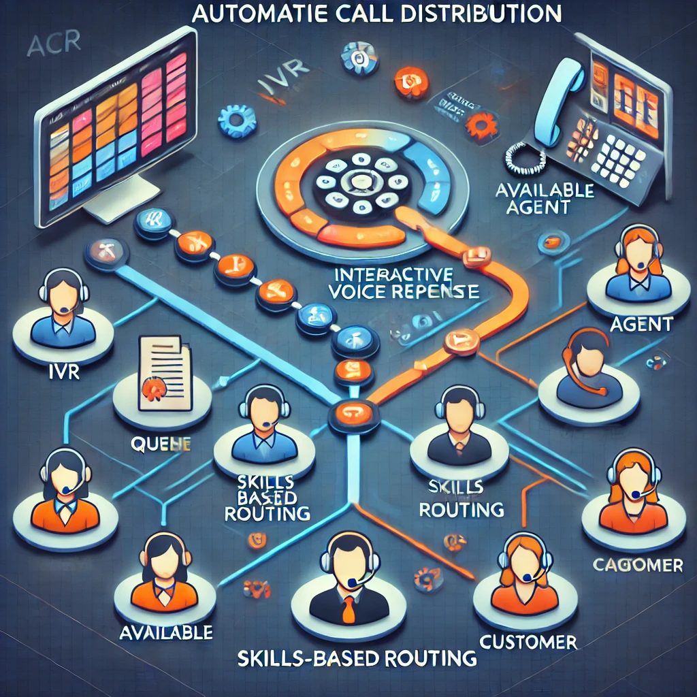

# ACD (Automatic Call Distribution)

## Overview

Automatic Call Distribution (ACD) is a crucial technology used in call centers to manage and route incoming calls to the most appropriate agent based on predefined rules. It automates the process of call routing, ensuring that calls are efficiently directed to the right department or agent, improving both operational efficiency and customer satisfaction.

ACD systems are designed to handle high volumes of incoming calls, direct them to the correct agents, and ensure that calls are answered in the shortest possible time. ACD is integral to modern call centers, helping manage customer interactions effectively, ensuring that no call is left unanswered or mishandled.

## Key Features of ACD

- **Call Routing**: Routes incoming calls to the appropriate agent or department based on specific criteria.
- **Queue Management**: Manages incoming calls when no agents are available, placing them in a queue and ensuring fair and efficient handling.
- **Skill-Based Routing**: Routes calls to agents based on their expertise or skill set.
- **Real-Time Monitoring**: Supervisors can monitor call queues and agent performance in real-time, ensuring optimal resource allocation.
- **Reporting and Analytics**: Provides detailed insights into call statistics, such as call volumes, wait times, and agent performance metrics.
- **Integration with IVR**: Often integrated with Interactive Voice Response (IVR) systems to gather information from the caller before routing the call to an agent.
- **Multi-Channel Support**: In addition to voice calls, ACD systems can also manage other communication channels like email, chat, and social media interactions.

## Types of Call Routing Methods

ACD systems use different methods to route incoming calls based on factors such as agent availability, skill level, and the nature of the call. Below are some common routing methods:

1. **Skills-Based Routing**:
   - Routes calls to agents based on their specific skill set or expertise.
   - For example, calls related to technical support will be directed to an agent skilled in handling technical queries, while calls related to billing will be routed to the billing department.

2. **Priority-Based Routing**:
   - Routes calls based on predefined priorities. High-priority customers (e.g., VIP customers) may be routed to the top agents or bypass the queue.
   - This is commonly used in service industries where certain clients need faster or more specialized service.

3. **Longest Idle Routing**:
   - Routes the incoming call to the agent who has been idle for the longest period.
   - This ensures that no agent is overwhelmed with multiple consecutive calls, and each agent has an opportunity to respond to calls in a timely manner.

4. **Round-Robin Routing**:
   - Calls are distributed evenly among available agents. After each agent answers a call, the next available agent is selected for the next incoming call.
   - This ensures fairness and helps distribute workloads evenly across agents.

5. **Time-of-Day Routing**:
   - Routes calls based on the time of day. For example, calls during peak hours may be routed to agents with higher skills, while calls during off-hours may be directed to a lower-priority queue.
   - It is especially useful in businesses that experience different volumes of calls at different times.

6. **Geographical Routing**:
   - Routes calls based on the geographical location of the customer or agent. This is particularly useful for global businesses where customers prefer to speak with agents in their region.

## How ACD Works

When a call enters the system, the ACD software evaluates the call and routes it based on specific rules. These rules can take into account factors such as:

- **Caller Input (via IVR)**: The Interactive Voice Response system may ask the caller to provide information (e.g., language preference, department selection) to help route the call correctly.
- **Agent Availability**: The system checks which agents are available or logged in to handle the call.
- **Skills and Experience**: If skill-based routing is enabled, the system will assess which agent has the appropriate expertise.
- **Call Priority**: Calls may be routed according to their priority level or the customer’s status (e.g., VIP).
- **Call Volume**: During peak hours or busy times, the ACD system may direct calls to the least-busy agents or place them in queues.

### ACD Workflow Diagram

To better understand how ACD works, here’s a detailed tree-like diagram that shows the process step-by-step:

```plaintext
                        +---------------------+
                        |  Incoming Call      |
                        |   (Caller Dials)    |
                        +---------------------+
                                   |
                                   v
                       +-----------------------+
                       |  IVR Interaction      |
                       | (Caller Input)        |
                       +-----------------------+
                                   |
                                   v
                    +----------------------------+
                    |  ACD Decision Process      |
                    | (Evaluates Routing Rules)  |
                    +----------------------------+
                                   |
                    +--------------+-------------+
                    |                            |
                   v                              v
          +------------------+           +-----------------------+
          | Skill-Based Routing|          | Queue-Based Routing   |
          +------------------+           +-----------------------+
                   |                              |
          +--------------------+         +-----------------------+
          | Available Agent with|         | Queue Management      |
          | Required Skill Set  |         | (Priority, Waiting)   |
          +--------------------+         +-----------------------+
                   |                              |
                   v                              v
        +----------------------+        +------------------------+
        | Call Connected to     |        | Call Connected to      |
        | Agent (Skill Match)   |        | Agent (First Available)|
        +----------------------+        +------------------------+
```

### Expanded Call Routing Process

1. **Incoming Call**: 
   - The call is received by the call center, either through a traditional landline, VoIP, or cloud-based communication system.
   
2. **IVR Interaction**:
   - The caller is greeted by the IVR system, which prompts them to select the appropriate department or service.
   - Based on their input (e.g., “Press 1 for Sales, Press 2 for Support”), the system can begin evaluating how to route the call.

3. **ACD Decision Process**:
   - The ACD system processes the call based on multiple criteria, including:
     - Caller input (via IVR).
     - Availability of agents.
     - Skills or experience needed to handle the call.
     - Prioritization or queuing rules (e.g., VIP customers).
     
4. **Skill-Based or Queue-Based Routing**:
   - Depending on the routing rules, the ACD routes the call either to an agent with the appropriate skill set (skills-based routing) or to the next available agent in the queue (queue-based routing).

5. **Call Connection**:
   - Once an agent is selected, the call is connected to them, and they begin assisting the customer.

## Benefits of Using ACD in Call Centers

1. **Improved Call Management**: ACD systems streamline the call routing process, ensuring that calls are directed to the most appropriate agent without manual intervention.
2. **Faster Response Times**: By efficiently managing call queues and directing calls to available agents, ACD helps reduce customer wait times.
3. **Increased Customer Satisfaction**: By ensuring that calls are routed based on customer needs (e.g., technical support or billing), customers are more likely to receive relevant and timely assistance.
4. **Efficient Resource Allocation**: ACD helps maximize the productivity of agents by ensuring that no one agent is overloaded with calls and that workloads are distributed fairly.
5. **Scalable Operations**: As call centers grow and handle more calls, ACD systems can scale to accommodate additional agents and routes without significant manual effort.
6. **Better Call Center Analytics**: ACD systems provide valuable reporting features that help managers monitor agent performance, call volumes, and customer service metrics.

## Conclusion

ACD (Automatic Call Distribution) is an essential technology for modern call centers, enabling efficient call routing, improved customer experience, and better resource management. Whether it’s skill-based routing, queue management, or integration with IVR systems, ACD ensures that customers are connected with the right agent quickly, minimizing wait times and enhancing service delivery.

By automating the call distribution process, ACD systems play a crucial role in increasing operational efficiency, boosting agent productivity, and enhancing overall customer satisfaction. 